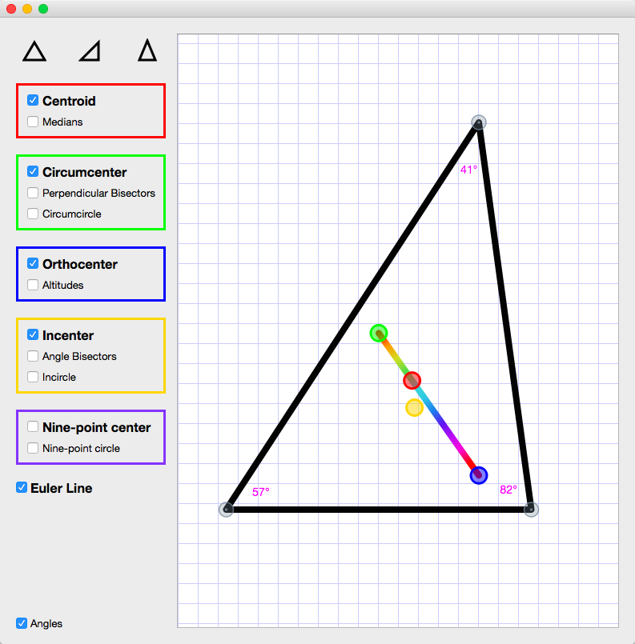
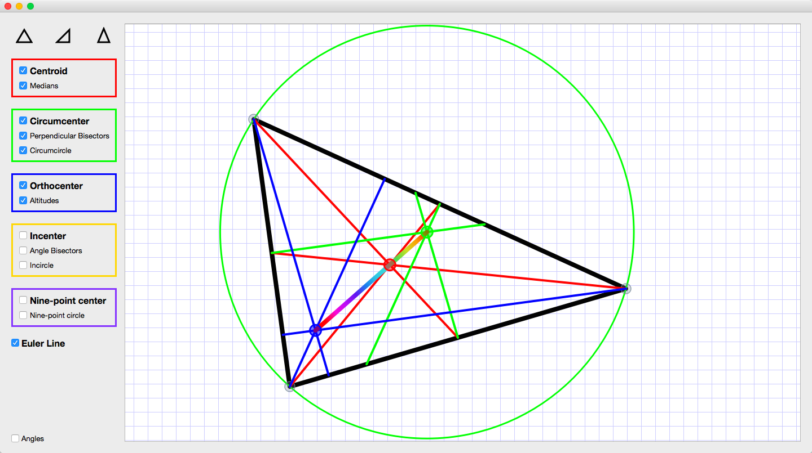
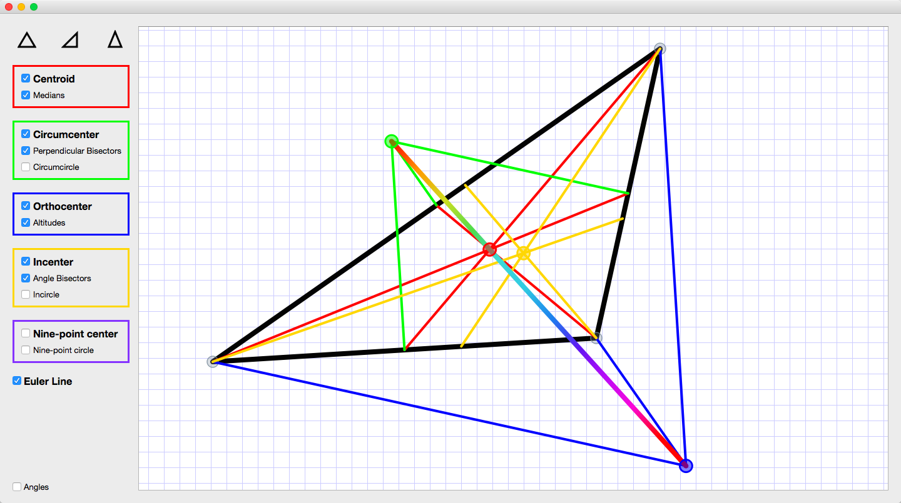
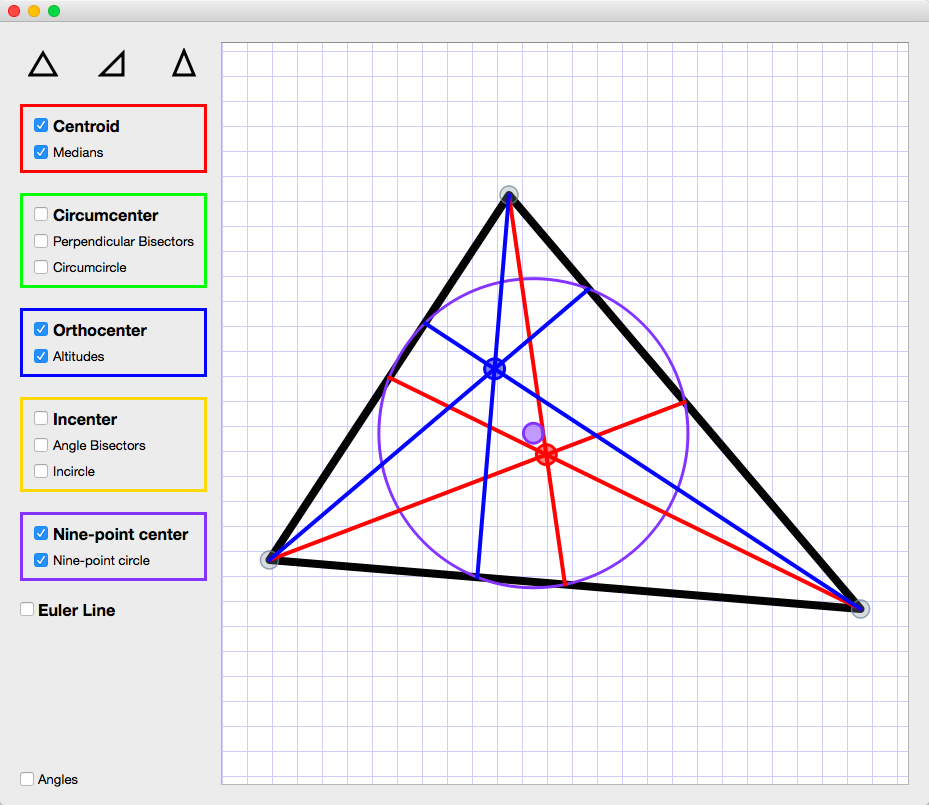

# Triangle Centers

Visualize 5 classical triangle centers and the Euler Line by moving the triangle vertices.

- Qt, PyQt5, Graphics View Framework
- Computer graphics, cartesian coorinates, geometry.

Inspired by [this video](https://www.youtube.com/watch?v=wVH4MS6v23U) with Zvezdelina.

